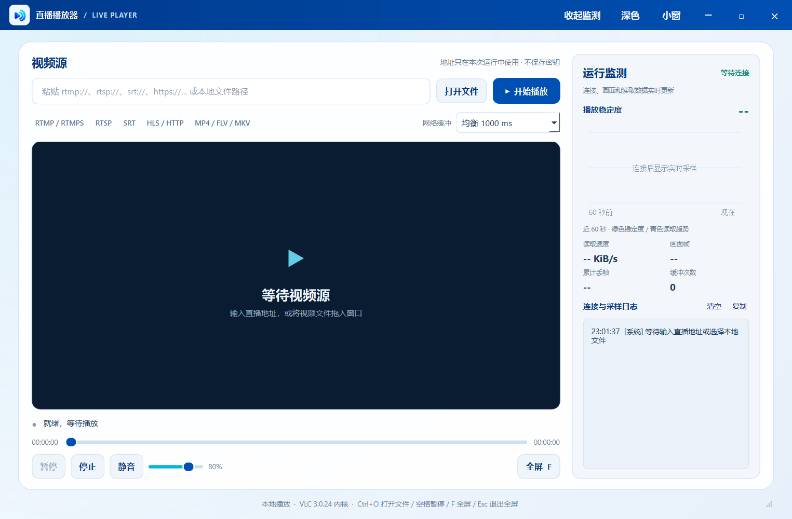

# 直播播放器

这是独立的 Windows 10（1809 或更新版本）/11 x64 单文件播放器版本。界面、窗口图标和背景均为通用播放器设计，不使用其他系统的名称、标识或背景图片。打包好的 EXE 放在[最新版本的附件](https://github.com/pythonqwq/live-player-windows/releases/latest)中；下载后直接运行，不需要安装 Python 或 VLC。



播放器使用 PySide6 和随 EXE 内置的 VLC 3.0.24，支持 RTMP、RTMPS、RTSP、SRT、HLS、HTTP/HTTPS 媒体地址及常见本地音视频文件。右侧运行监测区显示连接与读取日志、播放稳定度、读取趋势、画面帧和丢帧统计；窄窗口通过标题栏「监测」按钮切换。小窗可置顶、拖动和缩放，F 可进入全屏，Esc 退出全屏。

日志只保存在当前进程内，并仅显示脱敏后的网络来源；流地址中的账号、密码、签名参数不写入日志。稳定度是基于 VLC 播放状态、丢帧和流连续性的参考值，不代表网络服务质量保证。

## 从源码运行

需要 Python 3.13 x64、`requirements-build.txt` 中的依赖和 VLC 3.0.24 Win64 ZIP。可从 [VideoLAN 官方目录](https://download.videolan.org/pub/videolan/vlc/3.0.24/win64/) 下载 `vlc-3.0.24-win64.zip`，先用同目录的 `.sha256` 文件核验，然后解压到 `vendor-cache/unpacked/vlc-3.0.24`。当前构建所用 ZIP 的 SHA-256 为 `fcf30850371ad10c9373cc4f0f4501e7dee49e3e9ae9f20c72fb2661a1ca6323`。

```powershell
python -m pip install -r requirements-build.txt
python main.py
```

## 打包

```powershell
powershell -NoProfile -ExecutionPolicy Bypass -File .\build.ps1
```

标识源图为 [`assets/logo.png`](assets/logo.png)，Windows 图标为 [`assets/player.ico`](assets/player.ico)。构建结果、使用说明和第三方许可在 `dist` 目录。交付 EXE 不依赖当前目录的素材、源码或外部 VLC 安装。VLC 和 Python 构建缓存都由 `.gitignore` 排除，不随源码仓库上传。
